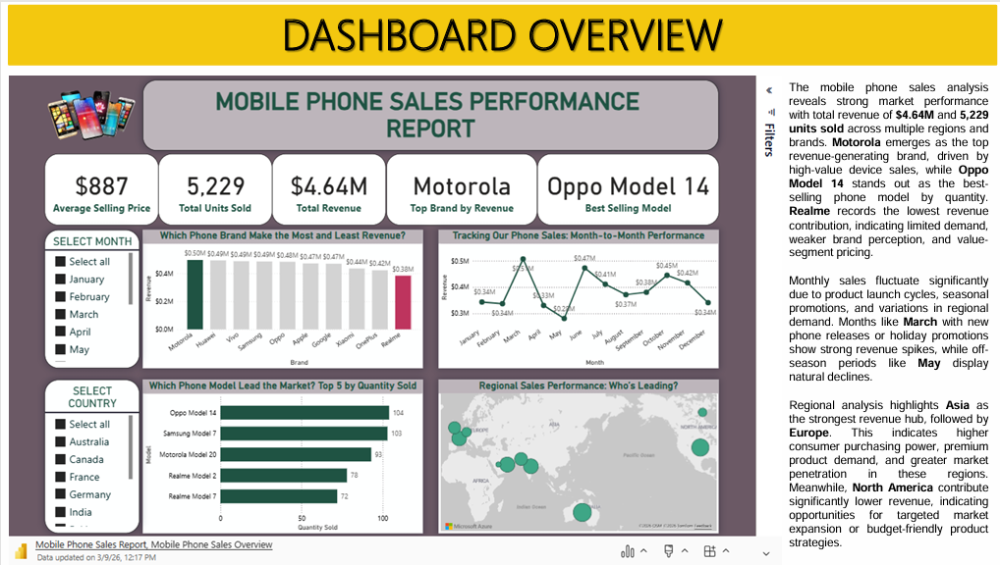
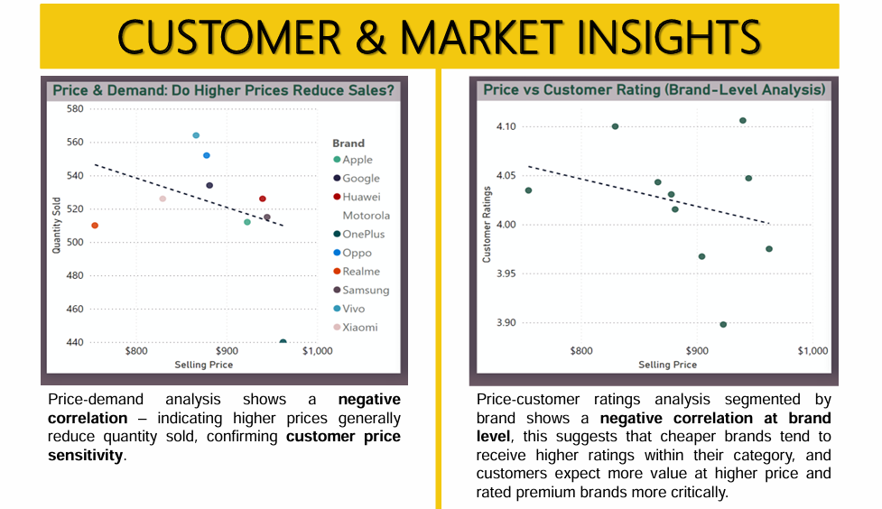
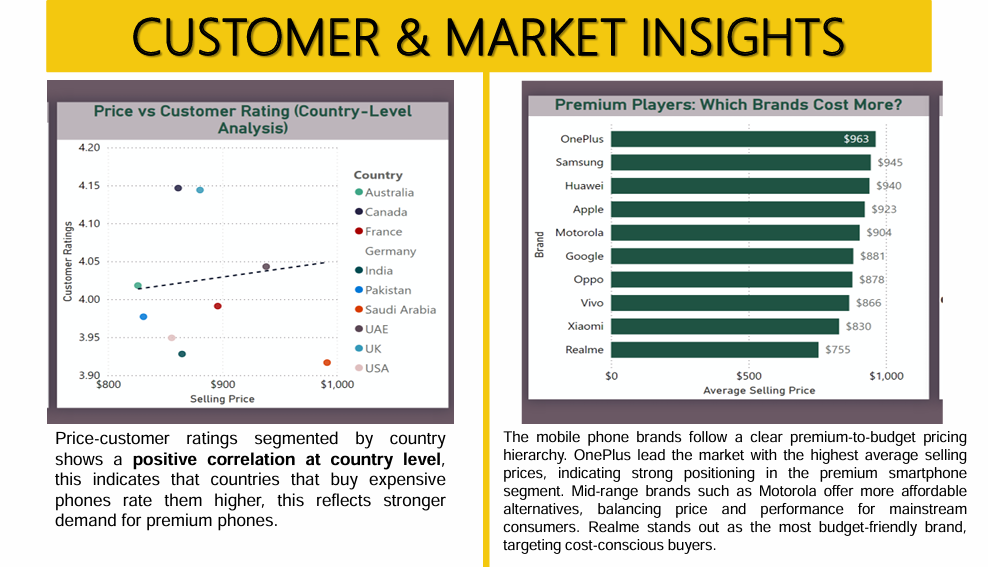
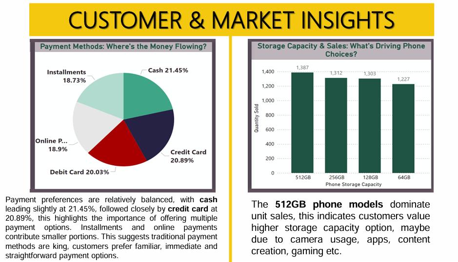
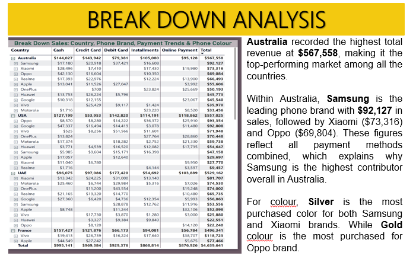

# 📊 Mobile Sales Performance Analysis
## Overview
This project analyzes mobile phone sales data across multiple brands, models, countries, and time periods. Using **Power BI**, the dataset was cleaned, modeled, and visualized to uncover sales patterns, product performance, revenue distribution, and the relationship between pricing and customer demand.

The goal is to transform raw data into actionable insights that support **strategic decision-making** in the mobile phone industry — one of the fastest-growing and most competitive technology markets.

---

## 🔍 Problem Statement
The mobile phone industry generates massive volumes of sales data. Without proper analysis, businesses struggle to answer critical questions:
- Which products drive revenue?
- Which markets perform best?
- How does pricing influence customer demand?

This project addresses these challenges by providing clarity on:
- Brand performance
- Product demand
- Revenue contribution
- Regional sales behavior
- Pricing relationships

---

## 🎯 Objectives
The analysis was designed to:
1. Identify the highest- and lowest-revenue-generating brands.
2. Determine the top 5 best-selling mobile models.
3. Calculate total revenue, total units sold, and average selling price.
4. Examine regional variations in sales performance.
5. Analyze the relationship between product price and quantity sold.
6. Present insights through an interactive **Power BI dashboard**.
7. Provide recommendations for strategic product and market decisions.

---

## 📈 Dashboard Highlights
- **Total Revenue:** $4.64M  
- **Total Units Sold:** 5,229  
- **Average Selling Price:** $887  
- **Top Brand by Revenue:** Motorola  
- **Best-Selling Model:** Oppo Model 14  

### Sample Dashboard Screenshots
Here are some representative visuals of the Power BI dashboard:

**Sales Overview Dashboard**  

**Customer and Market Insights I (Scatter plot)**  

**Customer and Market Insights II (Scatter plot & Bar Chart)**  

**Customer and Market Insights III (Pie & Column Chart)**  

**BreakDown Analysis (Matrix)**  

---

## 🔑 Key Insights
- **Price Sensitivity:** Higher prices generally reduce sales volume, showing customer price sensitivity.
- **Customer Ratings:** Cheaper brands often receive higher ratings, while premium brands are rated more critically.
- **Regional Trends:** Countries like Australia lead in revenue, while North America shows weaker demand.
- **Payment Preferences:** Cash (21.45%) and credit card (20.89%) dominate, but installment and online payments remain relevant.
- **Storage Capacity:** 512GB models dominate sales, reflecting customer preference for higher storage.

---

## 🛠 Tools & Technologies
- **Power BI** → Data cleaning, modeling, and visualization
- **Data Analysis Techniques** → KPI tracking, trend analysis
- **Visualization Methods** → Interactive dashboards, charts, and performance breakdowns

---

## 📌 Recommendations
1. Focus marketing on top-performing models (Oppo Model 14, Samsung Model 7, Motorola Model 20, Realme Model 2 & 7).
2. Strengthen presence in high-revenue regions (Asia, Europe, Australia).
3. Introduce budget-friendly options in weaker markets (e.g., North America).
4. Adjust pricing strategies to balance volume and profitability.
5. Replicate successful seasonal promotions to smooth revenue fluctuations.
6. Maintain diverse payment options and expand installment/online methods.
7. Track customer ratings closely to guide product improvements.
8. Improve underperforming brands (e.g., Realme) through upgrades and stronger positioning.

---

## ✅ Conclusion
This project successfully transformed raw mobile phone sales data into actionable insights. By leveraging Power BI dashboards, businesses can:
- Optimize product mix
- Target seasonal promotions
- Align pricing strategies with customer demand
- Strengthen market share and profitability

---
## 📂 Repository Structure

Mobile-Sales-Performance-Analysis/
│
├── images/              # Dashboard screenshots
└── README.md            # Project overview and documentation

---
